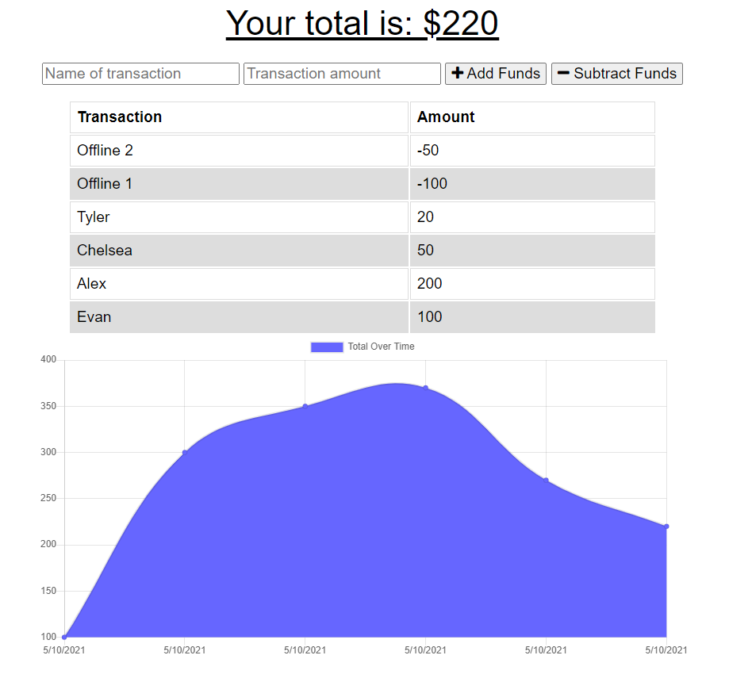

# Budget Tracker
## Description
This simple budget tracker application allows as user to add and subtract funds from their account as well as charting this activity over time. When offline, transactions are saved to IndexedDB and then retrieved and updated in the database when the page is connected to the internet and reloaded. The chart updates both when online and offline.
## Instructions
Enter a name for each transaction as well as the amount before choosing to 'Add Funds' or 'Subtract Funds' by clicking these buttons. When a button is clicked, the funds will be added to the log and added or subtracted from the total.

[Heroku Deployment](https://hidden-tor-54370.herokuapp.com/)

